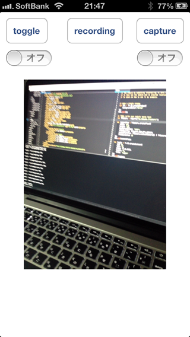

## TiCameraView
TiCameraView differ from Ti.Media.showCamera ;)

This CameraView is real time output ImageView from device camera. So the native camera control will not be displayed. But you can set the control buttons and control the movies by yourself.



### Feature
* Take picture
* Recording movie
* Toggle camera
* Focus and adjust exposure

### Future goal
* Recording audio in movie
* Overlay on CameraView. You can add Label and ImageView, any more on CameraView like overlay.
* GPUImage filters

## Build and Installation
1. $ git clone git@github.com:k0sukey/TiCameraView.git
2. $ cd TiCameraView
3. $ git submodule init
4. $ git submodule update
5. $ cd GPUImage
6. $ ./build.sh
7. $ cd ..
8. $ ./build.py
9. Generated be.k0suke.ticamera-iphone-x.x.zip file copy to your Titanium project

## Usage
More information, see example/app.js

### Create CameraView
```
var win = Ti.UI.createWindow();

var TiCamera = require('be.k0suke.ticamera');
var cameraView = TiCamera.createView({
	width: 240,
	height: 320,
	backgroundColor: '#000',
	videoQuality: TiCamera.QUALITY_MEDIUM,
	cameraPosition: TiCamera.hasFrontCamera() ? TiCamera.CAMERA_FRONT : TiCamera.CAMERA_BACK,
	frameDuration: 16
});
win.add(cameraView);

win.open();
```

### Take picture in CameraView
```
cameraView.takePicture({
	saveToPhotoGallery: true,	// default false
	shutterSound: false,		// default true
	success: function(e){
		// e.media(TiBlob), like Ti.Media.showCamera
	},
	error: function(e){
	}
});
```

### Recoding movie in CameraView
```
cameraView.startRecording({
	recordingSound: false		// default true
});

cameraView.stopRecording({
	saveToPhotoGallery: true,	// default false
	recordingSound: false,		// default true
	success: function(e){
		// e.media(TiBlob), like Ti.Media.showCamera
	},
	error: function(e){
	}
});
```

### Interval timer shooting camera in CameraView
```
var counter = 0;
cameraView.addEventListener('interval', function(e){
	// e.media(TiBlob), like Ti.Media.showCamera
	if (counter >= 10) {
		cameraView.stopInterval();
		return;
	}

	counter++;
});

cameraView.startInterval({
	saveToPhotoGallery: true,	// default false
	shutterSound: false,		// default true
	intervalDelay: 1000			// msec
});
```

### Toggle LED flash light
```
if (cameraView.isBackCamera()) {
	cameraView.toggleTorch();
} else {
	alert('Do not use toggleTorch method, in front camera mode');
}
```

### Properties

#### videoQuality
TiCamera.QUALITY_PHOTO / QUALITY_HIGH / QUALITY_MEDIUM / QUALITY_LOW / QUALITY_640x480 / QUALITY_1280x720

#### cameraPosition
TiCamera.CAMERA_FRONT / CAMERA_BACK

#### frameDuration
fps, roughly 16 - 30

### Methods

#### hasFrontCamera / hasBackCamera
Has camera check in device, front or back

#### hasTorch
Has LED flash light check in device

#### isFrontCamera / isBackCamera
Now camera mode, front or back in created CameraView method

#### isTorch
Now LED flash light on or off in created CameraView method

#### toggleCamera
Toggle front or back camera in created CameraView method

#### toggleTorch
Toggle LED flash light on or off in created CameraView method

#### takePicture
Take picrute in created CameraView method

#### startRecording / stopRecording
Recording movie in created CameraView method

#### startInterval / stopInterval
Interval timer shooting camera in created CameraView method

#### startCamera / stopCamera
Start or stop camera output in created CameraView method

### Events
#### interval
Interval timer shooting camera event

## In development
It may change in the future.

* GPUImage filters

```
cameraView.setSepia(true);
```

## Changelog
### Jul 23
* New methods, startCamera / stopCamera
* Written build and installation manual

### Jul 05
* Focus and adjust exposure

### Jun 28
* New methods, toggleTorch / isFrontCamera / isBackCamera / isTorch / hasTorch
* New methods, startInterval / stopInterval and new event interval for interval timer shooting

## License

The MIT License (MIT) Copyright (c) 2013 Kosuke Isobe, Socketbase Inc.

Permission is hereby granted, free of charge, to any person obtaining a copy of this software and associated documentation files (the "Software"), to deal in the Software without restriction, including without limitation the rights to use, copy, modify, merge, publish, distribute, sublicense, and/or sell copies of the Software, and to permit persons to whom the Software is furnished to do so, subject to the following conditions:

The above copyright notice and this permission notice shall be included in all copies or substantial portions of the Software.

THE SOFTWARE IS PROVIDED "AS IS", WITHOUT WARRANTY OF ANY KIND, EXPRESS OR IMPLIED, INCLUDING BUT NOT LIMITED TO THE WARRANTIES OF MERCHANTABILITY, FITNESS FOR A PARTICULAR PURPOSE AND NONINFRINGEMENT. IN NO EVENT SHALL THE AUTHORS OR COPYRIGHT HOLDERS BE LIABLE FOR ANY CLAIM, DAMAGES OR OTHER LIABILITY, WHETHER IN AN ACTION OF CONTRACT, TORT OR OTHERWISE, ARISING FROM, OUT OF OR IN CONNECTION WITH THE SOFTWARE OR THE USE OR OTHER DEALINGS IN THE SOFTWARE.